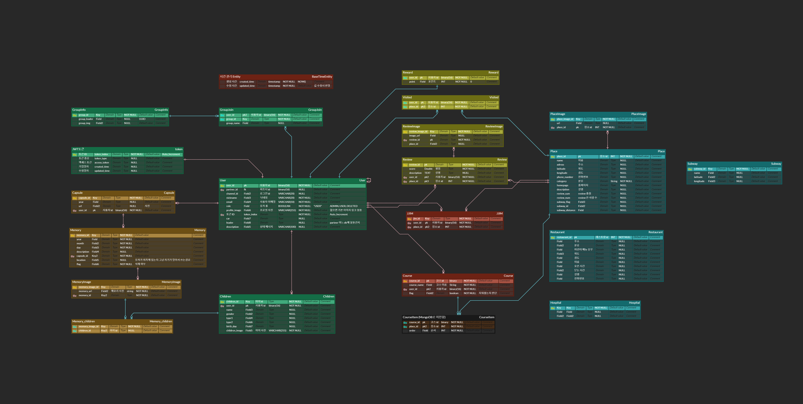
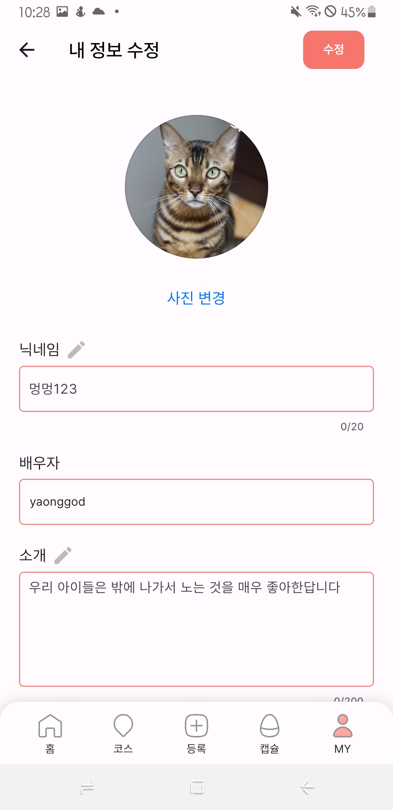
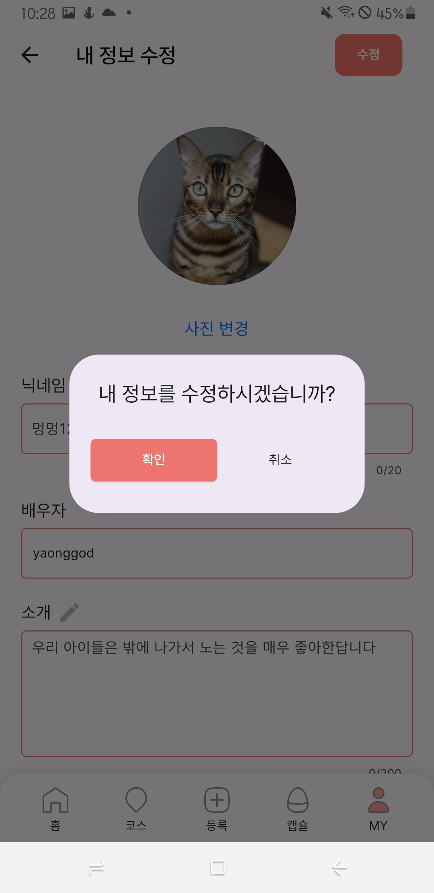
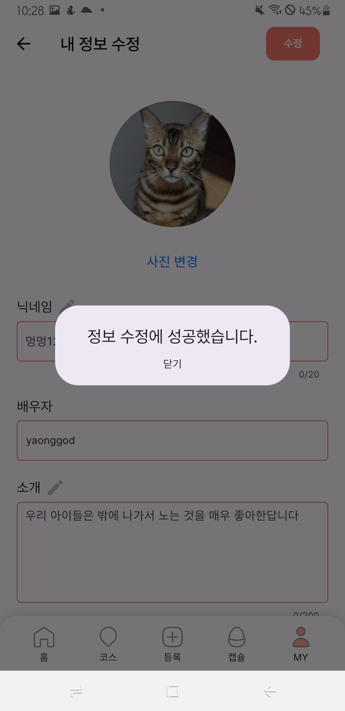
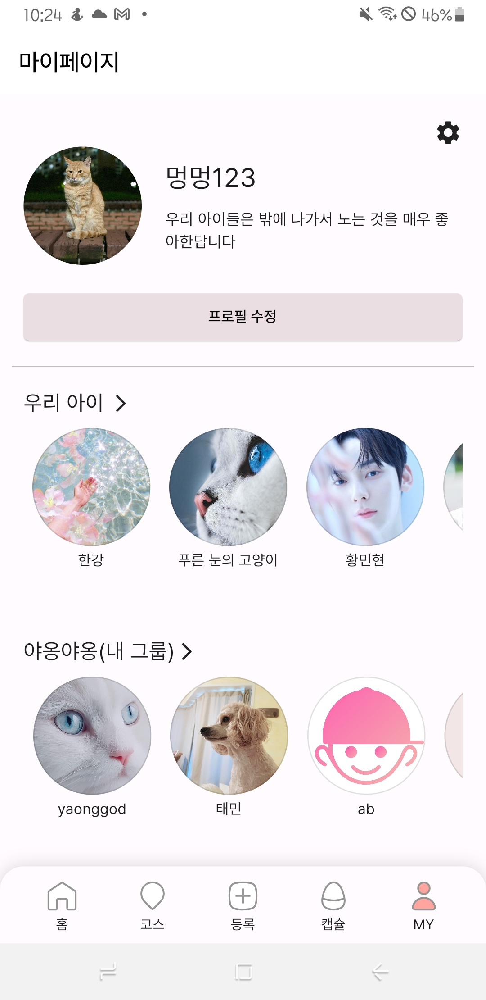
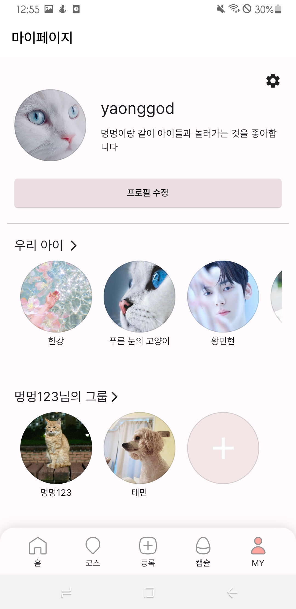
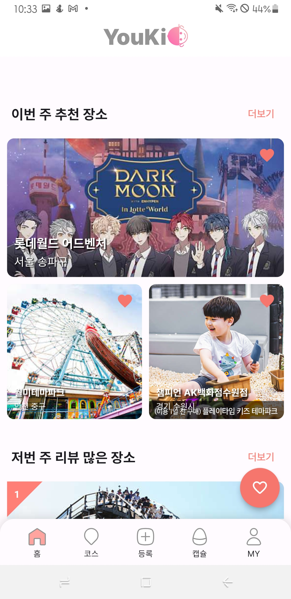
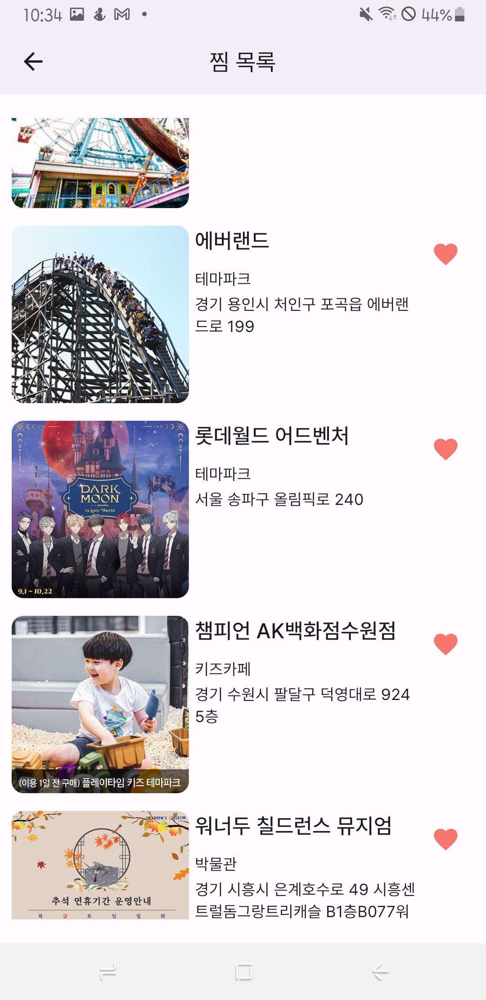

# ReadMe

# YouKids

## 프로젝트 소개

아이와 함께 할 수 있는 문화 활동을 추천하고, 아이와의 추억을 공유하는 어플리케이션

## 개발 기간

23.08.21 ~ 23.10.06

## 개발 환경

| IDE | Backend | Frontend | Database | 추천 | 배포 | 버전 관리 | 기타 |
| --- | --- | --- | --- | --- | --- | --- | --- |
| Intellij | SpringBoot 2.7 | Flutter 3.13.6 | MySql 8.0.34 | FastApi | Docker | Gitlab | Postman |
| Android Studio | Java 11 | Dart 3.1.3 | MongoDB |  | Nginx | Jira | Figma |
| Visual Studio Code | Gradle |  |  |  | Amazon EC2 |  | Firebase Messaging |
|  | Spring Boot JPA |  |  |  | Jenkins |  | Notion |

### IDE

- Intellij
- Android Studio
- Visual Studio Code

### Backend

- SpringBoot 2.7
- Java 11
- Gradle
- Spring Boot JPA

### Frontend

- Flutter 3.13.6
- Dart 3.1.3

### Database

- MySql 8.0.34
- MongoDB

### 추천

- FastApi

### 배포

- jenkins

### 버전 관리

- Gitlab
- Jira

### 기타

- Postman
- Figma
- Firebase Messaging
- Notion

## ERD

## 아키텍처

## 주요 기능

### 1. 회원

구글 로그인

정보 등록

내 정보 수정하기

배우자 등록하기

배우자와 공동으로 아이와 그룹 관리

### 2. 장소 추천

### 활용 데이터

### 추천 알고리즘

추천 리스트 보기

장소 상세보기

장소 찜하기

### 3. 코스 생성하기

### 4. 캡슐에 추억 저장하기

### 5. 그룹 관리

- 그룹 초대

- 그룹원 추가

### 6. 아이 관리

## 팀원

                     김선우
               백엔드, 인프라

                     김재석
                  프론트엔드

                    이제원
                    풀스택

                    이주용
                    풀스택

                    태준모
                    풀스택

                     허태민
                     백엔드